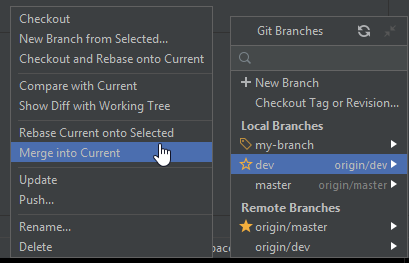
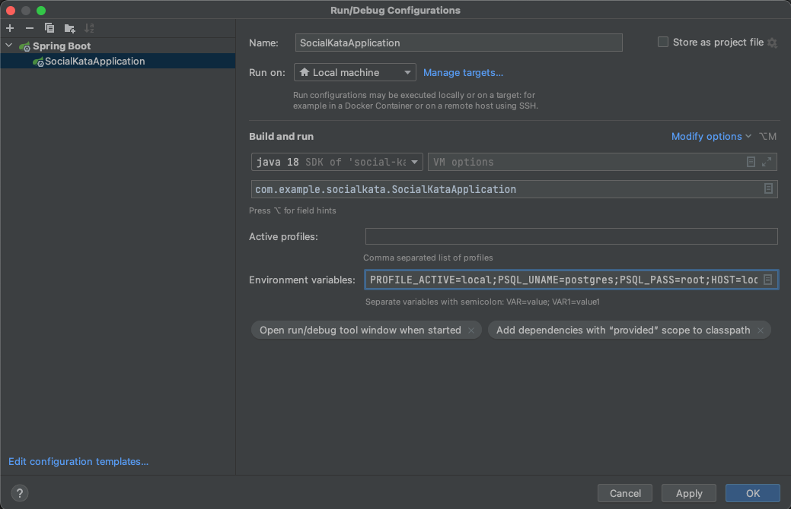

# Документация social-kata
## Работа с git
### Клонирование проекта

1. На странице репозитория убедитесь, что выбрана ветка **dev** (1), нажмите кнопку **Clone** (2), скопируйте ссылку (3).


2. Откройте **Intellij IDEA**, нажмите **Get from version control** на экране приветствия, либо **VCS | Git | Clone...** в меню.


3. Вставьте скопированную ссылку в строку **URL**, нажмите **Clone**.


### Перед внесением изменений в код
Создайте новую ветку в git-репозитории и работайте в ней. Для этого:
1. Нажмите на текущую ветку **dev** в правом нижнем углу.


2. Выберите **New branch**.


3. Введите название своей новой ветки (на ваше усмотрение) и нажмите **Create**.


### Добавление своего кода в общий репозиторий. Git push.

Прежде чем создать merge request вам необходимо подготовить вашу ветку к отправке в общий репозиторий.

1. Нажмите на текущую ветку в правом нижнем углу. Выберите опцию **dev | update**.
   Таким образом вы скачаете в свою локальную ветку **dev** все коммиты которые были замержены,
   пока вы работали в своей ветке.


2. Убедитесь, что в данный момент активна ваша рабочая ветка (занчек ярлыка слева от имени, как у ветки my-branch на скриншоте).
   Выберите опцию **dev | Merge into Current**. Таким образом вы добавите все изменения из ветки **dev** в вашу ветку. При возникновении конфликтов разрешите их.



3. ---**ВАЖНО**--- Убедитесь что проект собирается и запускается.

4. Выберите вашу ветку и нажмите на **Push...** чтобы добавить её в общий репозиторий.


### Создание merge request

1. Создайте новый merge request. В качестве **Source branch** выберите свою ветку, **Target branch** - **dev**.


2. Проверьте данные, допишите комментарии при необходимости. Обратите внимание на опцию **Delete source branch when merge request is accepted**.
   Завершите создание реквеста, приложите ссылку на него в карточку таска на Trello.


## Сущности

### Users

#### Поля:

- **userId** - уникальный идентификационный номер пользователя;
- **first_name** - имя пользователя;
- **last_name** - фамилия пользователя;
- **date_of_birth** - дата рождения пользователя;
- **education** - образование пользователя;
- **about_me** - информация о пользователе;
- **image** - аватарка пользователя;
- **email** - адрес электронной почты пользователя;
- **profession** - профессия пользователя;
- **status** - идентификатор статуса пользователя;
- **active_id** - идентификатор состояния пользователя;
- **password** - пароль пользователя;
- **persist_date** - время регистрации пользователя;
- **last_redaction_date** - дата последней редакции;
- **is_enable** - подтверждение почты пользователя;
- **role_id** - идентификационный номер пользователя;
- **city** - город рождения/проживания пользователя;
- **link_site** - ссылка на сайт пользователя;

```
Таблица, которая описывает основной пользовательский функционал, который соответствует стандартному
функционалу социальных сетей: переписка с другими пользователями, посты, добавление различных медиа документов. 
Наделен ролью. Связан с остальными сущностями через уникальный идентификационный номер.
```

### Role

#### Поля:

- **id** - уникальный идентификационный номер роли;
- **name** - наименование роли;
```
Определяет порядок прав действий пользователя в системе.
```

### Language

#### Поля:

- **id** - уникальный идентификационный номер языка;
- **name** - наименование языка;
```
Определяет набор языков пользователей в системе.
```


### UserHasAlbum

#### Поля:

- **id** - уникальный идентификационный номер записи;
- **persist_date** - дата создания записи;
- **album_id** - уникальный идентификационный номер альбома;
- **user_id** - уникальный идентификационный номер пользователя, сохранившего альбом;
```
Таблица, сдержащая информацию о альбом, сохранённых пользователями.
```

### UserTabs

#### Поля:

- **id** - уникальный идентификационный номер записи на стене;
- **persist_date** -  дата создания записи;
- **post-id** - уникальный идентификационный номер поста;
- **user_id** - уникальный идентификационный номер пользователя, сделавшего запись;
```
Таблица, содержащая информаию о записях на стене пользователя;
```

### UsersAudiosCollections

#### Поля:

- **user_id** - уникальный идентификационный номер пользователя;
- **audio_id** - уникальный идентификационный номер аудиозаписи;
```
Таблица, содержащая информацию об аудио коллекциях пользователей.
```

### UsersVideosCollections

#### Поля:

- **user_id** - уникальный идентификационный номер пользователя;
- **video_id** - уникальный идентификационный номер видеозаписи;
```
Таблица, содержащая информацию о видео коллекциях пользователей.
```

### UsersGroupChats

#### Поля:

- **user_id** - уникальный идентификационный номер пользователя;
- **group_chat_id** - уникальный идентификационный группового чата;
```
Таблица, содержащая информацию о групповых чата пользователей.
```

### Friends

#### Поля:

- **id** - уникальный идентификационный номера связи сущностей пользователя и друга;
- **user_id** - уникальный идентификационный номер пользователя;
- **user_id** - уникальный идентификационный номер друга пользователя;
```
Таблица, которая связывает поле пользователя с полем его друга через связь many-to-one.
```

### Followers

#### Поля:

- **id** - уникальный идентификационный номера связи сущностей пользователя и его подписчиков;
- **user_id** - уникальный идентификационный номер пользователя;
- **follower_id** - уникальный идентификационный номер подписчика пользователя;
```
Таблица, которая связывает поле пользователя с полями его друзей через связь many-to-one.
```

### Active

#### Поля:

- **id** - уникальный идентификационный номер активности;
- **name** - наименование активности;
```
Определяет набор статусов активности пользователей в системе.
```

### Groups

#### Поля:

- **id** - уникальный идентификационный номер группы;
- **name** - наименование группы;
- **persist_date** - дата создания группы;
- **last_redaction_date** - дата последней редакции группы;
- **link_site** - ссылка на сайт;
- **category_id** - уникальный идентификационный номер категории группы;
- **owner_id** - уникальный идентификационный номер владельца группы;
- **description** - описание группы;
- **address_image_group** - ссылка на логотип группы;
```
Таблица, которая содержит в себе записи обо всех существующих группах с информацией о ней и ее владельце.
У группы есть связанная сущность "Стена", на которой пользователи могут выкладывать посты, комментировать.
их, лайкать.  
```

### GroupCategory

#### Поля:

- **id** - уникальный идентификационный номер категории;
- **category** - название категории;
```
Таблица, содержащая информацию о категории группы;
```
### GroupHasUser

#### Поля

- **id** - уникальный идентификационный номера связи сущностей группы и ее подписчиков;
- **group_id** - уникальный идентификационный номер группы;
- **user_id** - уникальный идентификационный номер пользователя;
- **persist_date** - дата подписки пользователя;
```
Таблица, которая связывает информацию об уникальных идентификационных номерах
группы и пользователя и дату образования этой связи.
```

### GroupCategory

#### Поля:

- **id** - уникальный идентификационный номер категории;
- **category** - наименование категории;
```
Сущность, которая связывает уникальный идентификационный номер категории и ее наименование.
```

### GroupWall

#### Поля:

- **group_id** - уникальный идентификационный номер группы;
- **post_id** - уникальный идентификационный номер поста;
```
Производная таблица, которая связывает поле номера группы с полями номеров постов через связь one-to-many.
```

### Bookmarks

#### Поля:

- **id** - уникальный идентификационный номер закладки;
- **user_id** - уникальный идентификационный номер сохранившего пользователя;
- **post_id** - уникальный идентификационный номер поста;
- **persist_date** - дата создания закладки;
```
Производная таблица, которая связывает поле номера сохранившего пользователя с полями номеров 
постов через связь one-to-many.
```

### Posts

#### Поля:

- **id** - уникальный идентификационный номер поста;
- **title** - наименование поста;
- **text** - текстовая информация в посте;
- **user_id** - уникальный идентификационный номер пользователя-владельца поста;
- **persist_date** - дата создания поста;
- **last_redaction_date** - дата последней редакции поста;
```
Таблица, которая инициализирует информацию о посте.
```

### PostMedia

#### Поля:

- **post_id** - уникальный идентификационный номер поста;
- **media_id** - уникальный идентификационный номер медиа документа;
```
Производная таблица, которая связывает поле номера поста с полями номеров медиа документов через связь one-to-many.
```

### PostTags

#### Поля:

- **post_id** - уникальный идентификационный номер поста;
- **tags_id** - уникальный идентификационный номер тэга;
```
Производная таблица связей Many-to-many тэгов и постов;
```

### Tags

#### Поля:

- **id** - уникальный идентификационный номер тэга;
- **text** - текст тэга;
```
Таблица, содержащая информацию о тэгах.
```

### Comments

#### Поля:

- **id** - уникальный идентификационный номер комментария;
- **user_id** - уникальный идентификационный номер пользователя;
- **comment_type** - тип комментария;
- **comment** - текстовая информация в комментарии;
- **persist_date** - время создания комментария;
- **last_redaction_date** - время последней редакции комментария;
```
Таблица, которая содержит информацию о созданном комментарии.
```

### CommentLike

#### Поля:

- **like_id** - уникальный идентификационный номер поставленного лайка;
- **comment_id** - уникальный идентификационный номер комментария;
```
Таблица, которая связывает информацию о лайке и номере комментария.
```

### PostComments

#### Поля:

- **post_id** - уникальный идентификационный номер поста;
- **comment_id** - уникальный идентификационный номер комментария;
```
Таблица, которая связывает информацию о номере поста и комментария.
```

### PostLike

#### Поля:

- **like_id** - уникальный идентификационный номер поставленного лайка;
- **post_id** - уникальный идентификационный номер поста;
```
Таблица, которая связывает информацию о номере лайка и поста.
```

### Like

#### Поля:

- **id** - уникальный идентификационный номер лайка;
- **user_id** - уникальный идентификационный номер пользователя;
- **like_type** - тип лайка;
```
Таблица, которая содержит информацию о созданном лайке.
```

### MessageLike

#### Поля:

- **like_id** - уникальный идентификационный номер лайка;
- **message_id** - уникальный идентификационный номер сообщения;
```
Производная таблица связей One-to-one сообщений и лайков;
```

### MediaLikes

#### Поля:

- **like_id** - уникальный идентификационный номер лайка;
- **media_id** - уникальный идентификационный номер медиа документа;
```
Производная таблица, которая связывает поле номера лайка с полями номеров медиа документов через связь one-to-many.
```

### MediaComment

#### Поля:

- **comment_id** - уникальный идентификационный номер комментария;
- **media_id** - уникальный идентификационный номер медиа документа;
```
Производная таблица, которая связывает поле номера комментария с полями номеров медиа 
документов через связь one-to-many.
```

### Messages

#### Поля:

- **id** - уникальный идентификационный номер сообщения;
- **message** - вложенная в сообщение информация;
- **is_unread** - статус прочтения посланного сообщения;
- **persist_date** - время создания сообщения;
- **last_redaction_date** - время последней редакции сообщения;
- **user_id** - идентификационный номер юзера, отправившего сообщение;
```
Таблица, которая содержит информацию о созданном сообщении. 
```

### SingleChat

#### Поля:

- **id** - уникальный идентификационный номер чата;
- **image** - лого чата;
- **persist_date** - время создания чата;
- **user_one_id** - уникальный идентификационный номер пользователя-отправителя;
- **user_two_id** - уникальный идентификационный номер пользователя-получателя;
```
Таблица, которая содержит информацию о чате, в том числе one-to-one связь с уникальным 
идентификационным номером пользователя-отправителя и пользователя-получателя, а также
связь one-to-many c уникальным идентификационным номером пользователя. В чате происходит
обмен данными различного типа между пользователями.
```

### SingleChatMessages

#### Поля:

- **chat_id** - уникальный идентификационный номер чата;
- **message_id** - уникальный идентификационный номер сообщения;
```
Производная таблица one-to-many связей чата и сообщений.
```

### GroupChats

#### Поля:

- **id** - уникальный идентификационный номер группового чата;
- **image** - лого чата;
- **persists_date** - дата создания группового чата;
- **title** - название группового чата;
```
Таблица содержит основную информацию о групповом чате.
```

### GroupChatMessages

#### Поля:

- **chat_id** - уникальный идентификационный номер группового чата;
- **message_id** - уникальный идентификационный номер сообщения;
```
Производная таблица one-to-many связей групповго чата и сообщений.
```


### GroupChatsUsers

#### Поля:

- **group_chat_id** - уникальный идентификационный номер группового  чата4
- **users_user_id** - уникальный идентификационный номер пользователя;
```
Производная таблица связей many-to-many групповых чатов и пользователей.
```

### Media

#### Поля:

- **id** - уникальный идентификационный медиа документа;
- **user_id** - уникальный идентификационный номер пользователя, создавшего медиа документа;
- **url** - ссылка на медиа документ;
- **media_type** - тип медиа документа;
- **persist_date** - время создания медиа документа;
- **album_id** - уникальный идентификационный номер альбома;
```
Таблица, которая содержит информацию о медиа документе для возможности предоставления его самого
и информации о нем пользователю. Медиа документ может быть представлен в виде видое, изображения или
аудиозаписи.
```

### MediaMessages

#### Поля:

- **message_id** - уникальный идентификационный номер сообщения;
- **media_id** - уникальный идентификационный номер медиа документа;
```
Производная таблица, которая связывает поле номера сообщения с полями номеров 
медиа документов через связь one-to-many.
```

### Albums

#### Поля:

- **id** - уникальный идентификационный номер альбома;
- **name** - наименование альбома;
- **icon** - лого альбома;
- **persist_date** - время создания альбома;
- **media_type** - тип содержащихся медиа документов;
- **user_owner-id** - уникальный идентификационный номер пользователя-владельца альбома;
```
Таблица, которая содержит информацию об альбоме.
```

### AlbumAudios

#### Поля:

- **album_id** - уникальный идентификационный номер аудио альбома;
```
Таблица, содаржащая идентификационные номера аудио альбомов.
```

### AlbumHasAudio

#### Поля:

- **album_id** - уникальный идентификационный номер аудио альбома;
- **audios_id** - уникальный идентификационный номер аудио записи;
```
Производная таблица связей Many-to-many аудио албомов и аудио записей.
```

### AlbumHasImage

#### Поля:

- **album_id** - уникальный идентификационный номер фото альбома;
- **image_id** - уникальный идентификационный номер изображения;
```
Производная таблица связей Many-to-many фото албомов и изображений.
```

### AlbumHasVideo

#### Поля:

- **album_id** - уникальный идентификационный номер видео альбома;
- **video_id** - уникальный идентификационный номер видео записи;
```
Производная таблица связей Many-to-many фидео албомов и видео записей.
```

### AlbumImage

#### Поля:

- **album_id** - уникальный идентификационный номер фото альбома;
```
Таблица, содаржащая идентификационные номера фото альбомов.
```

### AlbumVideo

#### Поля:

- **album_id** - уникальный идентификационный номер видео альбома;
```
Таблица, содаржащая идентификационные номера видео альбомов.
```

### Playlists

#### Поля:

- **playlist_id** - уникальный идентификационный номер плейлиста;
- **image** - логотип плейлиста;
- **name** - названий плейлиста;
- **persist_date** - дата создания плейлиста;
- **user_id** - уникальный идентификационный номер пользователя-создателя плейлиста;
```
Таблица, содержащая информацию о плейлистах.
```

### PlaylistHasAudio

#### Поля:

- **playlist_id** - уникальный идентификационный номер плейлиста;
- **audios_id** - уникальный идентификационный номер аудио файла;
```
Производная таблица связей Many-to-many плейлиста и аудио записей.
```

### Audios

#### Поля:

- **media_id** - уникальный идентификационный номер медиа документа;
- **icon** - иконка для аудио файла;
- **name** - имя для аудио файла;
- **author** - автор для аудио файла;
- **album** - альбом для аудио файла;
- **length** - длина аудио файла;
```
Таблица, которая связывает информацию о медиа документе типа AUDIO
```

### Videos

#### Поля:

- **media_id** - уникальный идентификационный номер медиа документа;
- **icon** - иконка для видео файла;
- **name** - наименование аудио документа;
- **author** - наименование автора аудио файла;
```
Таблица, которая связывает информацию о номере медиа документа и его иконки
```

### Images

#### Поля:

- **media_id** - уникальный идентификационный номер медиа документа;
- **description** - иконка для аудио файла;
```
Таблица, которая связывает информацию о номере медиа документа и его описании 
```

### Reposts

#### Поля:

- **id** - уникальный идентификационный номер репоста;
- **post_id** - уникальный идентификационный номер поста;
- **user_id** - уникальный идентификационный номер пользователя;
```
Производная таблица, которая связывает поле номера поста с полями номеров пользователей через связь many-to-many.
```


### FlyWay Migration 

#### В данный проект была введена миграция от FlyWay:
 
Flyway позволяет контролировать структуру баз данных, если ваша работа предполагает работу с БД
Вам нужно создать новый миграционный файл например V0000X__insert_value_into_role.sql и прописать туда ваш SQL запрос


### Использование нескольких профилей

Для того чтобы можно было использовать разные настройки (например, работа с разными базами данных) добавлено несколько **properties-файлов**
**application.properties** - основной конфигурационный файл, используемый по умолчанию. Содержит общие для всех конфигураций настройки.
**application-local.properties** - конфигурационный файл для подключения локальной базы данных на своем компьютере. Можно добавлять другие настройки, не используемые в рабочем проекте.
**application-dev.properties** - конфигурационный файл для подключения к удаленной рабочей базе, используемой в проекте.

```
Для переключения конфигурации на local необходимо задать значения следующих environment variables
PROFILE_ACTIVE=local
HOST=localhost
PORT=5432
BD_NAME=(имя вашей локальной БД)
PSQL_UNAME=(ваше username локальной БД)
PSQL_PASS=(ваш пароль к локальной БД)

```
Для этого нужно:
1. Зайти в редактирование конфигурации


2. Добавить поле Environment variables через выпадающее меню Modify options


3. Заполнить поле Environment variables соответствующими значениями (как на скриншоте, подставив ваши значения после знаков '='', значение переменной PROFILE_ACTIVE оставляем без изменений)



```
Для переключения конфигурации на dev (удаленная БД) необходимо задать значение environment variables
PROFILE_ACTIVE=dev
Переменные PSQL_UNAME и PSQL_PASS не используются, тк они общие для всех участников проекта 
```


### Database rider

**Database Rider** - предназначен, чтобы тестирование базы данных было не сложнее юнит-тестирования. Данная тула базируется на Arquillian и поэтому в Java проекте нужна лишь зависимость для DBUnit. Также возможно использование аннотаций, как в JUnit, интеграция с CDI через интерсепторы, поддержка JSON, YAML, XML, XLS и CSV, конфигурация через те же аннотации или yml файлы, интеграция с Cucumber, поддержка нескольких баз данных, работа с временными типами в датасетах.

Для подключения **Database Rider** была добавлена зависимость в pom-файл:

```
<dependency>
<groupId>com.github.database-rider</groupId>
<artifactId>rider-junit5</artifactId>
<version>1.32.0</version>
<scope>test</scope>
</dependency>
```

Для запуска тестов необходимо создать dataset файлы в папке `src/test/resources/datasets/`. Можно использовать следующие форматы - JSON, YAML, XML, XLS и CSV. **У нас на проекте будет использоваться XML формат**.
Данные файлы содержат тестовые записи для наших баз данных и используются для тестирования CRUD операций с БД.

Документация по библиотеке **Database Rider** - https://github.com/database-rider/database-rider#examples-1 

Видео по работе с библиотекой **Database Rider** (английский с русским акцентом :) ) - https://www.youtube.com/watch?v=1eRDIAqUBVU


